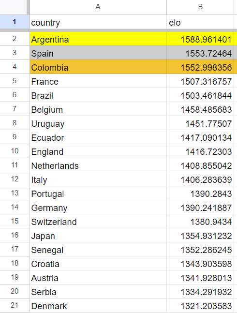

# International Football Elo

This is a program to find out the ELO of a football team based on every single international game played. Source of data is [this Kaggle dataset by Mart Jürisoo](https://www.kaggle.com/datasets/martj42/international-football-results-from-1872-to-2017/data).

Once that is downloaded, put the CSV files in `internation-football-results/`. You only need `results.csv` as penalty shootouts are not considered and are awarded as a draw to both teams.

Once downloaded, run `make_table.py`. (You should remove the 2nd line on the newly created `elos.csv`; this may or may not be fixed by me later.)

After that, run `evaluate.py`. The code takes a while to run but you should see the results in `elos.csv` after it is done.

